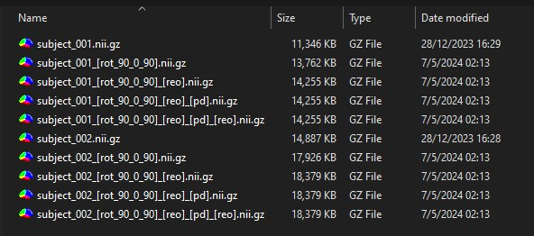

# Nifti Tools 🧠🛠️🧰

This repository contains a Pytorch implementation of functions for NIFTI image processing. This functions allows to change some image characteristic as dimension (shape), spacing and the affine matrix, do data matrix operations as translation, rotation and reslacing, and also fix data order to match the canonical view. 

This tools were mainly developed for fixing common problems in image preprocessing. For example, issues related to missing crucial data when transforming from DICOM to NIFTI format. In this way, you can combine this tools to create individual processing pipelines to fix different kind of issues. Also, this pipelines, called config files, are easy to set and apply.

## Content
1. [Installation](#Installation)
2. [Configuration](#Configuration)
3. [How to run](#How-to-run)

## Installation
- Install [Python](https://www.python.org/downloads/)
- Clone Nifti Tools repository or download it
```
git clone https://github.com/hkulsgaard/nifti_tools
```
- Install requirements
```
pip install -r requirements.txt
```

## Configuration
In order to apply the provided functions, you have to set a `config file` before. This config file should be in YAML format and contains the functions that you want to apply with its respective parameters. Each config file is a pipeline of functions that are applied serially. This allows you to create different processing pipelines stored in individual config files.

>For more information about YAML, please refer to [the official site](https://yaml.org/spec/1.2.2/)

### Functions and parameters

This repository provides a set of functions ready to be applied to nifti images. Every function starts with a dash `"-"` followed by a blank space, the function name and a colon punctuation `":"`. Then, each parameter should be listed with a tab space, the parameter's name, colon punctuation `":"`, a blank space and, finally, the value. Note that code identation is fundamental here.

Example:
```yaml
- function1_name:
    parameter_1: value
    parameter_2: value

- function2_name:
    parameter_3: value
    parameter_4: value

- function3_name:
    parameter_5: value
    parameter_6: value
```
In this case, the `function1` will take as input the selected nifti images. Its outputs will be the inputs of the `function2`. Then, the `function2` outputs will be the inputs of the `function 3` and its outputs will be the final processed images. In summary, the functions will be executed serially for the selected input images.

Now, we are goint to describe every function and its parameters.

- **`reorder_to_canonical`**: Sets the world and the voxel orientation to Right Anterior Superior (RAS), also called Canonical order.

    - `save_partial`: (Boolean) If "True", the output image in this step will be saved.
    
    Example:
    ```yaml
    - reorder_to_canonical:
        save_partial: False
    ```

- **`rotate`**: Rotates the image in the indicated degrees for each plane
    - `save_partial`: (Boolean) If "True", the output image in this step will be saved.
    - `degrees`: (Numberic array) Degrees for each plane.

    Example:
    ```yaml
    - rotate:
        save_partial: False
        degrees: [90,0,90]
    ```

- **`set_origin_point`**:Sets the origin point (0,0,0) to the specified voxel in the data matrix. The origin point corresponds to the anatomical view and depends on the affine matrix. The data matrix refers to the image itself and its voxels coordinates does not depends on the affine matrix. For example, if you have a nifti image with a shape of 121x145x121 and you want the origin point located in the center of the volume, you would set the "voxel" parameter as [60, 72, 60].
    - `save_partial`: (Boolean) If "True", the output image in this step will be saved.
    - `point`: (Numeric array)

    Example:
    ```yaml
    - set_origin_point:
        save_partial: False
        voxel: [60, 72, 60]
    ```

- **`set_pixel_dimension`**: Sets the pixel dimension for each plane as indicated by pixdim.
    - `save_partial`: (Boolean) If "True", the output image in this step will be saved.
    - `pixdim`: (Numeric array) The new pixel dimension to be set.

    Example:
    ```yaml
    - set_pixel_dimension:
        save_partial: False
        pixdim: [1.5, 1.5, 1.5]
    ```

- **`reslice`**: Restructurates the image data with a new shape (dim) and spacing (pixdim).
    - `save_partial`: (Boolean) If "True", the output image in this step will be saved.
    - `dim`: (Numeric array) The new dimension to be set, also called "shape".
    - `pixdim`: (Numeric array) The new pixel dimension to be set, also called "spacing".

    Example:
    ```yaml
    - reslice:
        dim: [121, 145, 121]
        pixdim: [1.5, 1.5, 1.5]
        save_partial: False
    ```

- **`affine_to_identity`**: Replace the affine matrix for the identity matrix
    - `save_partial`: (Boolean) If "True", the output image in this step will be saved.

    Example:
    ```yaml
    - affine_to_identity:
        save_partial: False
    ```


- **`affine_to_diagonal`**: Transform the affine matrix to be a diagonal matrix.
    - `save_partial`: (Boolean) If "True", the output image in this step will be saved.

    Example:
    ```yaml
    - affine_to_diagonal:
        save_partial: False
    ```

### Example configuration file
```yaml
- rotate:
    save_partial: False
    degrees: [90,0,90]
    
- reorder_to_canonical:
    save_partial: False

- set_pixel_dimension:
    save_partial: False
    pixdim: [1,0.75,0.75]
    
- reorder_to_canonical:
    save_partial: False
```

### Notes
- You can create different config files for every processing pipeling. For example, if you need to make different modifications depending on the dataset, you can set individual config files for every dataset.

- After processing images, store the config file in the same directory of the input/output images for future usage and reference.

- The parameter `save_partial` is very useful when experimenting. Set it `True` to keep a close watch for every function. In this way, if there is some error in the final image, you can check which function is causing the problem.

- All processed images are stored in the compressed lossless `.gz` format, saving time and storage space.

- It is possible to develop new functions. You just need to add a new class in the `nifti_functions.py` file that inherits from `NiftiFunction` and add the function name in the dictiony of functions inside the `manager.py` file.


## How to run
In order to run Nifti tools you have to install all the requirements described in [Installation section](#Installation) and then open a terminal located in the directory where this code is stored and type:

```
python nifti_tools.py
```
Then, a dialog box is going to popup asking you to select the YAML configuration file. After that, another dialog box is going to ask you to select the Nifti images to process. You can select one or more and it needs to be in `nii` or `nii.gz` format.

The output images will be stored in the same directory of the input images with its respectives suffixes for every function applied. Here is an example:

